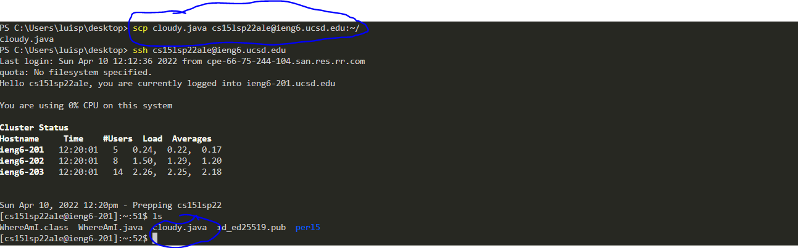
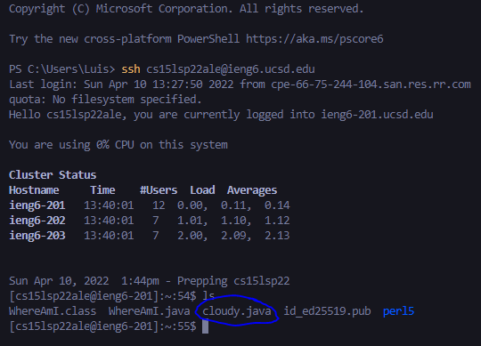
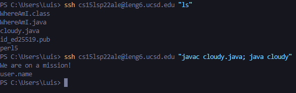

# How to log into a course-specific account on ieng6

## Installing VScode
---
The first step to being able to access the ieng6 cloud is by installing VScode.

(Click [Here](https://code.visualstudio.com/) to be directed to the website)

Once fully installing VSCode you are going to want create a new java file and open up a new terminal. To create a new java file you will need to select `File` -> `New File` and you should be prompted to select to a language (Java) and begin to code, once ready to connect to the ieng6 cloud you must create a new terminal. Begin by clicking `Terminal` -> `New Terminal`.

## Remotely Connecting
---

To begin your remote connection to the ieng6 cloud you are going to begin by typing in `ssh cs15lsp22zz@ieng6.ucsd.edu` (the 'zz' prior to the '@' may vary and you can check what is yours 3 letter ID for the course [Here](https://sdacs.ucsd.edu/~icc/index.php)). After running that line you will be prompted to enter a password, enter the password you use for your UCSD email and you should obtain a screen as the image shown above. Note that in my image it does not ask me for a password, later you too will obtain this neat trick!
## Trying Some Commands!
---

Best way to get familarized with something new is to try out a couple commands and see what their functions are. Here I demonstrate 3 commands, `ls`, to view all files associated with your login, `pwd`, to view the current location you are at on ieng6, `ls -l`, to see all youre files and when they were created.

## Moving Files with `scp` 
---

Something neat about ieng6 server is that files from your current computer can be moved through ieng6 and be retrived on another computer. This can be done by first going to correct directory that your current file is in and then typing in `scp (filename.java) cs15lsp22zz@ieng6.ucsd.edu:~/`. It will then ask for your password and login as usal and then once you have done that log back into ieng6 as shown in step2 and type `ls`, there you should see your file you just SCP! 

-This is on a different device demonstrating how the file moves
## Setting an SSH Key
---

Now to log into ieng6 without a password, begin by typing in `ssh-keygen` or `ssh-keygen -t ed25519`(if on windows) and you will be prompted to enter a file path and type in `/Users/<user-name>/.ssh/id_rsa`. You will then be promopted to put in a passphrase, however you do not want this so make sure to press enter twice. After, you are going to want to log into ieng6 and type `mkdir .ssh` and log out by pressing `Ctrl` + `D` once logged out, type in `scp /Users/<user-name>/.ssh/id_rsa.pub cs15lsp22zz@ieng6.ucsd.edu:~/.ssh/authorized_keys`, and put in your password. Go ahead and try to log into ieng6 one more time and if followed correctly, you can now login without a password! 

## Optimizng Remote Running
---

Now that we have always neat tricks there are more easier ways to call commands without much effort. For example instead of logging into ieng6 and then waiting for everything to load to check your files you could simply just do `ssh cs15lsp22zz@ieng6.ucsd.edu "ls"`. The way this works is that this line can run whatever command is within quotation marks (" ") in ieng6 without being fully within ieng6. It even works with running files!    
