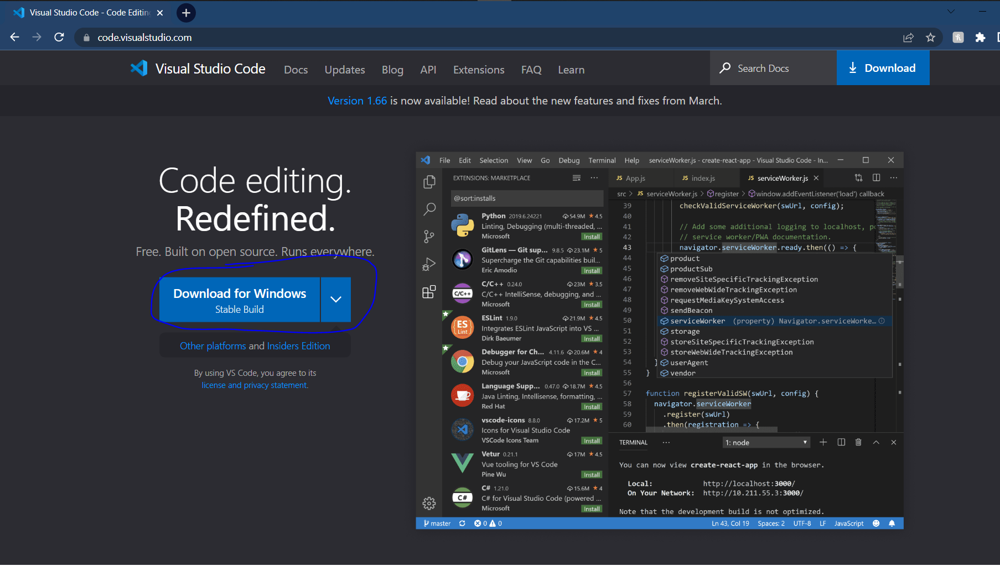
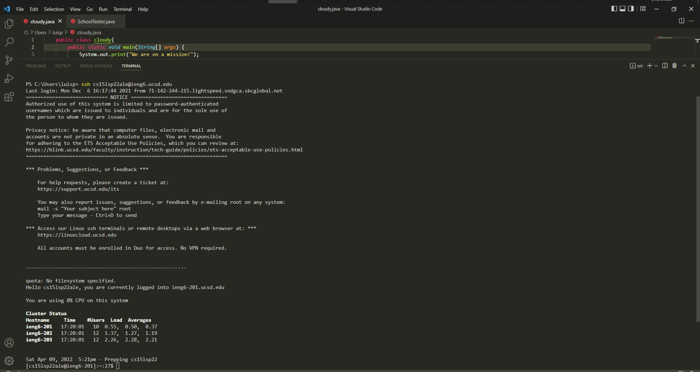
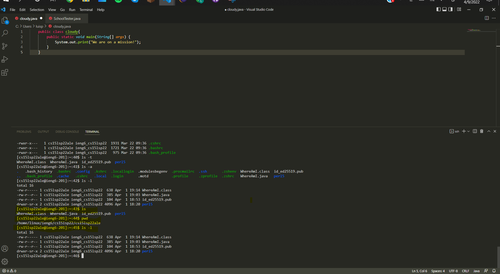

# How to log into a course-specific account on ieng6

## Installing VScode
---
The first step to being able to access the ieng6 cloud is by installing VScode.

(Click [Here](https://code.visualstudio.com/) to be directed to the website)

Once fully installing VSCode you are going to want create a new java file and open up a new terminal. To create a new java file you will need to select `File` -> `New File` and you should be prompted to select to a language (Java) and begin to code, once ready to connect to the ieng6 cloud you must create a new terminal. Begin by clicking `Terminal` -> `New Terminal`.

## Remotely Connecting
---

To begin your remote connection to the ieng6 cloud you are going to begin by typing in `ssh cs15lsp22zz@ieng6.ucsd.edu` (the 'zz' prior to the '@' may vary and you can check what is yours 3 letter ID for the course [Here](https://sdacs.ucsd.edu/~icc/index.php)). After running that line you will be prompted to enter a password, enter the password you use for your UCSD email and you should obtain a screen as the image shown above. Note that in my image it does not ask me for a password, later you too will obtain this neat trick!
## Trying Some Commands!
---

Best way to get familarized with something new is to try out a couple commands and see what their functions are. Here I demonstrate 3 commands, `ls`, `pwd`, `ls -l`.

## Moving Files with `scp` 
---

## Setting an SSH Key
---
a

## Optimizng Remote Running
---
a
