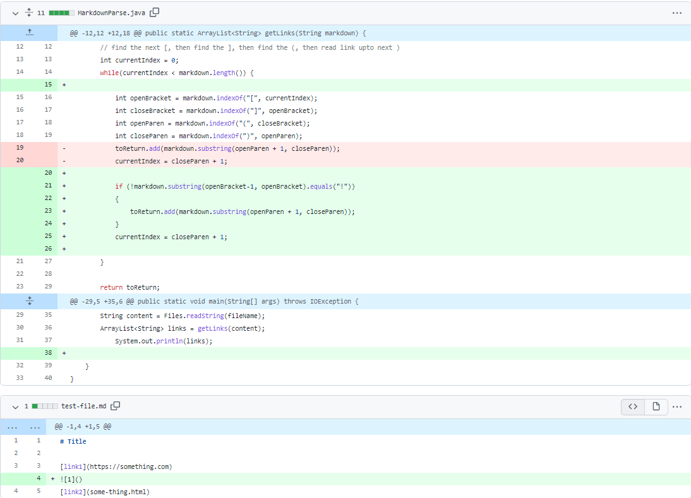
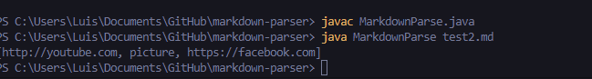

# Lab Report 2
## Demonstarting a code change

The image above depicts the changes I made to my code in order to incoporate images into a single markdown file while only grabbing the links within the file. The file titled "[test2.md](https://github.com/ldpina/markdown-parser/blob/main/test2.md)" outputs the wrong output when MarkdownParse.java runs.

Displayed now is the output that came from running MarkdownParse.java file on `Test2.md` This is what caused me to make the edits in green in the first image. The bug that becomes apparent is the image intialization which is in line 3.

 ## What is the difference between a bug, symptom and failure-inducing input?
A bug is what occured in this situation above, where we get an output that was able to complie however it was not what we assumed it to be. A symptom is when we try to complie and it results in an error where we have to go back and look at our code to figure out how to get rid of this sympton these could be `indexOutofBound`, `IOexpcetion`, etc. Finally we arrive at failure inducing inputs, these are usally created to ensure that your code can run properly no matter the circumstance they may encounter, for example the test-file2.md cotained an Image refrence which looks fairly similar to the way adding a link is structured so, we do this to purposly try and break our code to enusure the quality of it overall.
