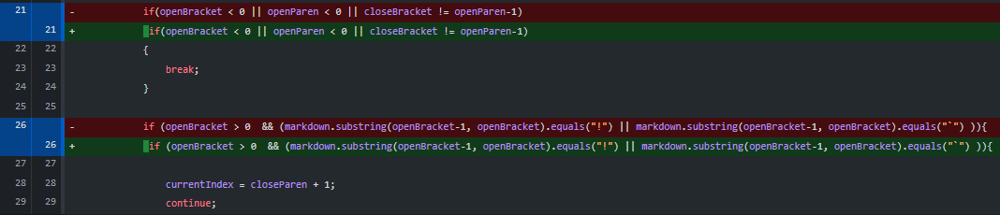
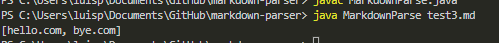
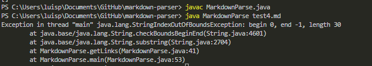

# Lab Report 2
## Demonstarting a code change

The image above depicts the changes I made to my code in order to incoporate images into a single markdown file while only grabbing the links within the file. The files titled "[test2.md](https://github.com/ldpina/markdown-parser/blob/main/test2.md)", "[test3.md](https://github.com/ldpina/markdown-parser/blob/main/test3.md)", and "[test4.md](https://github.com/ldpina/markdown-parser/blob/main/test4.md)" outputs the wrong output when MarkdownParse.java runs.

 

`Output 1`

`Output 2`

`Output 3`

The following images displayed are the outputs that came from running MarkdownParse.java files on `Test2.md`, `Test3.md`, and `Test4.md`. This is what caused me to make the edits in green in the first two images of this site. The bug that becomes apparent for `Output 1` is the image intialization in line 4. The bug that becomes apparent for `Output 2` is the attempt to bold a link in line 1. The bug that becomes apparent for `Output 3` is the dissapreance of the paraenthesis when creating a link in line 3.

 ## What is the difference between a bug, symptom and failure-inducing input?
A bug is what occured in `output 1` and `output 2`, we were able to get an output that was able to complie, however it was not what we assumed it to be. A symptom is when we try to complie and it results in an error where we have to go back and look at our code to figure out how to get rid of this sympton these could be `indexOutofBound`, `IOexpcetion`, for `output 3` we recieved a `StringIndexOutOfBoundsException` error. Finally we arrive at failure inducing inputs, these are usally created to ensure that your code can run properly no matter the circumstance they may encounter, for example, the test2.md cotained an Image refrence which looks fairly similar to the way adding a link is structured,  `test3.md` had attempted to bold a link and `test4.md` tried to create a link without parentheses so, we do this to purposly to try and break our code to enusure that it will output the correct output no matter what is thrown at it.
