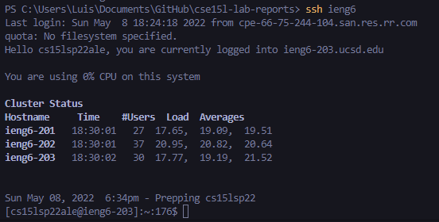
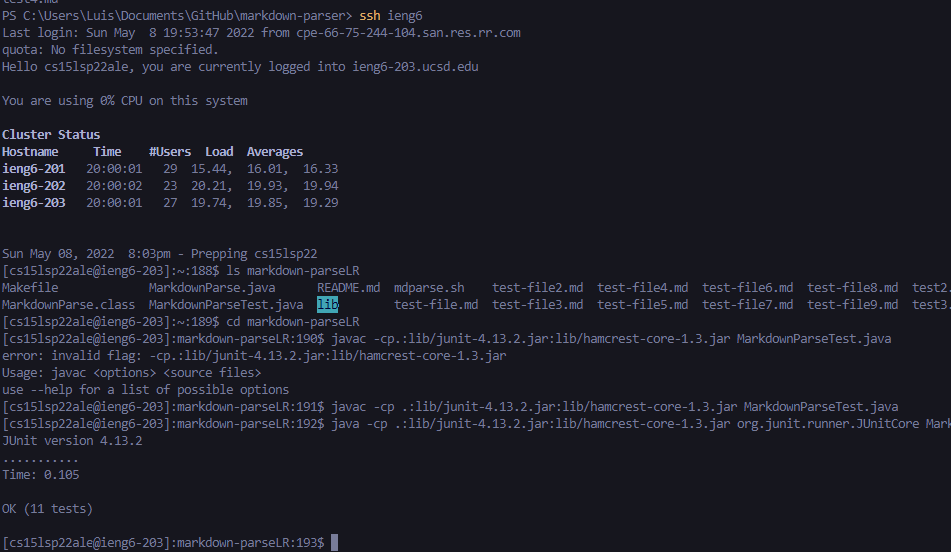

# Lab 3

## Streamlining ssh Configuration

Above is a demonstration creating a file named `config` and inputting credentials to create a faster experince when logging in

Now that the `config` file was created you can now type `ssh ieng6` and it will automatically log you in.

Depicted above is now using the "ieng6" nickname in action where we scp a random file in our directory to the ieng6 server.
## Setting up Github Access from ieng6

Above is the public key that I created and stored in github.

Here is where to find the private key I had created in ieng6.
## Copying whole directories with scp -r

When running `scp -r.ieng6:markdown-parseLR` it will copy all the cotents of the respoirtory you curretntly in and store it in a folder named what you desire, so in this case it is name dmarkdown-parseLR.

Depicted above is showing how the respority is now copied into ieng6