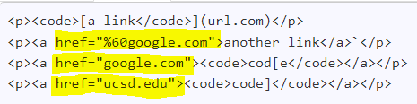
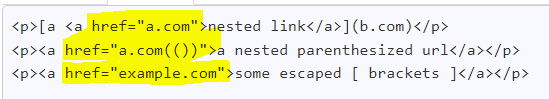
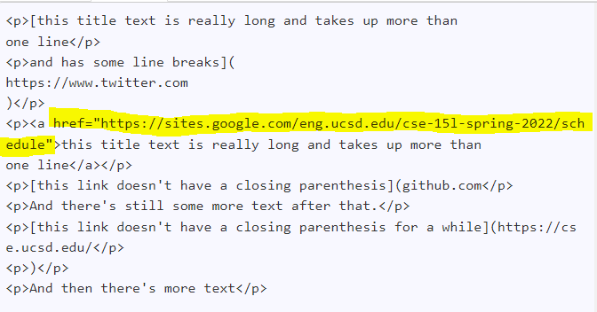
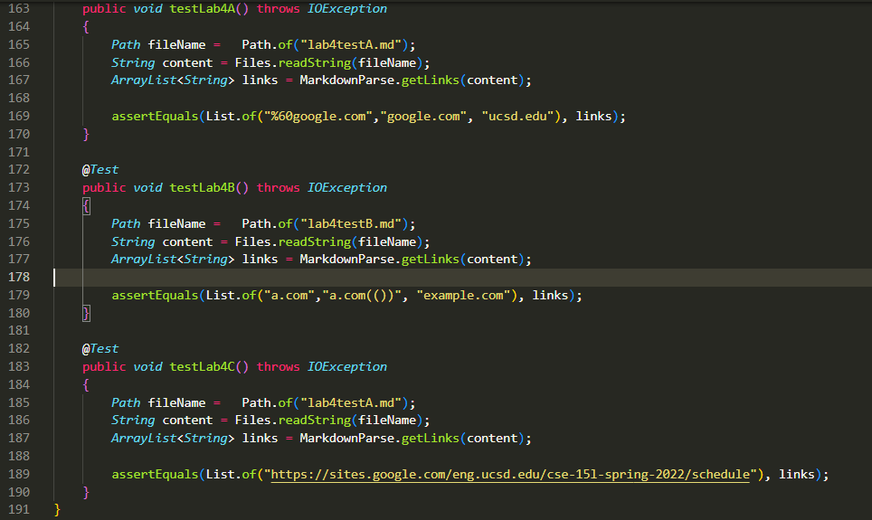
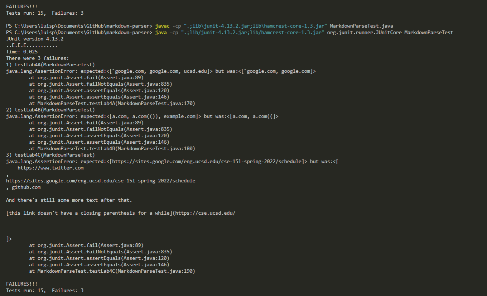
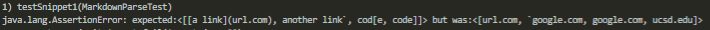
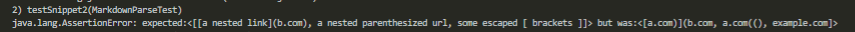
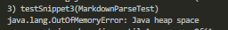

# Lab Report 4

[Link for markdown-parse repo](https://github.com/ldpina/markdown-parser.git)

[Link for repo reviewed in week 7](https://github.com/Shresthhooda/markdown-parser)

# Expected links highlighted

## Snippet 1

## Snippet 2

## Snippet 3

# Imported Tests in `MY REPO`

## My Implementation

## My errors

## Reviewed Repo errors

## Is Snippet 1 Fixable or unfixable under 10 lines?
I believe snippet 1 is not fixable below or in 10 lines. The fix to be able to get the correct outputs will require having to creating multiple new variables and assigning them to the index at a certain position and using if statements to compare the two then having to create a way to manipulate a link title to read the ast ']'thatss next to the '( )' part of the link. 

## Is Snippet 2 Fixable or unfixable under 10 lines?
I believe snippet 2 is not fixable below or in 10 lines. Alike snippet 1 you need to create multiple variables to hold the indexes of the first '(' and the last ')' then find a way to ensure that any other symbols are taken along with the full clickalble string name.

## Is Snippet 3 Fixable or unfixable under 10 lines?
I believe snippet 3 is fixable below or in 10 lines. The fix would require having to use an if statement to disregard indexs of any '] (' that have a '\n' between then two symbols and if it has '\n' before the ')' then add it to the list of links.