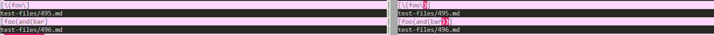
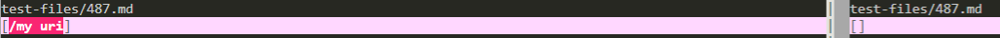
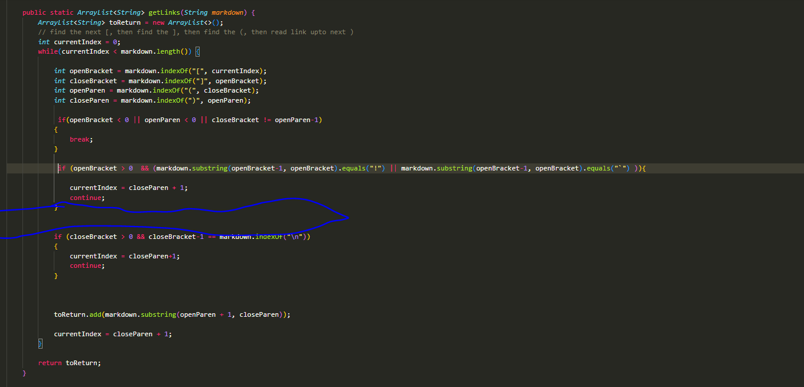
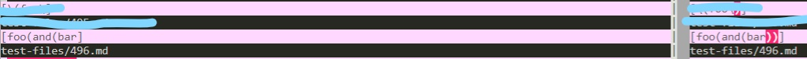
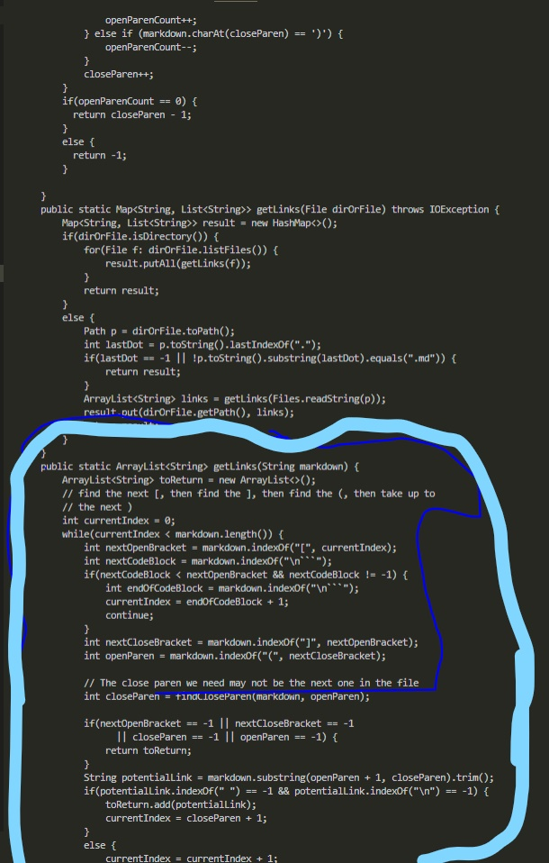

# Lab Report 5

## Comparsion between parsers

The way I was able to find the the difference between the two parsers was through using vimdiff.

## Links to different error files
[test-file/487.md](https://github.com/nidhidhamnani/markdown-parser/edit/main/test-files/487.md)

[test-file/496.md](https://github.com/nidhidhamnani/markdown-parser/edit/main/test-files/496.md)

## Test file 487.md
The correct output is one on the right as it should output []. The correct output can reinfornced by the [CommonMark demo site](https://spec.commonmark.org/dingus/).

*Depicted above is outputted difference is between my markdown-parser(left) and the cse15lsp22-markdown-parser(right).*

The markdown parser on the left has the incorrect output. The expected output should be [] as the error is that the link has a space and does not have a domain such as .com, edu, .net, etc. The way to fix this is by creating two if statements one of them being if the whats between '( )' contains a space then don't return a link as well as if it does not have a domain. Since there are mulitiple domain names you could have you could create an arrayList to contain all the multiple domains that are possible.

*Change would have to between the two if statemnets tp add more if statements and a intializing an arrayList*

## Test file 496.md
Neither outputs are the correct outputs. The output should be [] as there will be no retruning links, this output can be reinforced by the [CommonMark demo site](https://spec.commonmark.org/dingus/).

*Depicted above is outputted difference is between my markdown-parser(left) and the cse15lsp22-markdown-parser(right).*

Whats wrong with the format of the test file is that there are multiple occurences of `'[', '(', ')'and ']'` what makes this bug occur is that the program tries to intially find the first occurence of each character highlighed. The way its suppose to work is to look for the last closed characters to ensure everything is included and to debug this you would have to create mulpitple variables to be able to place hold the mulitple occurences of the characters and then using if statements to wead out the errors.

*Change would be need to made to the getLinks method of both MarkdownParse.java*